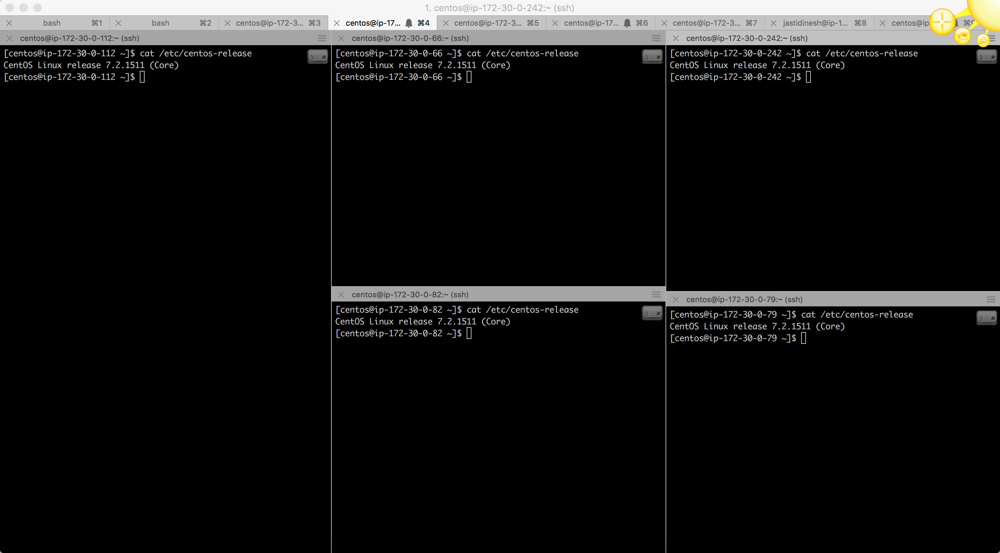
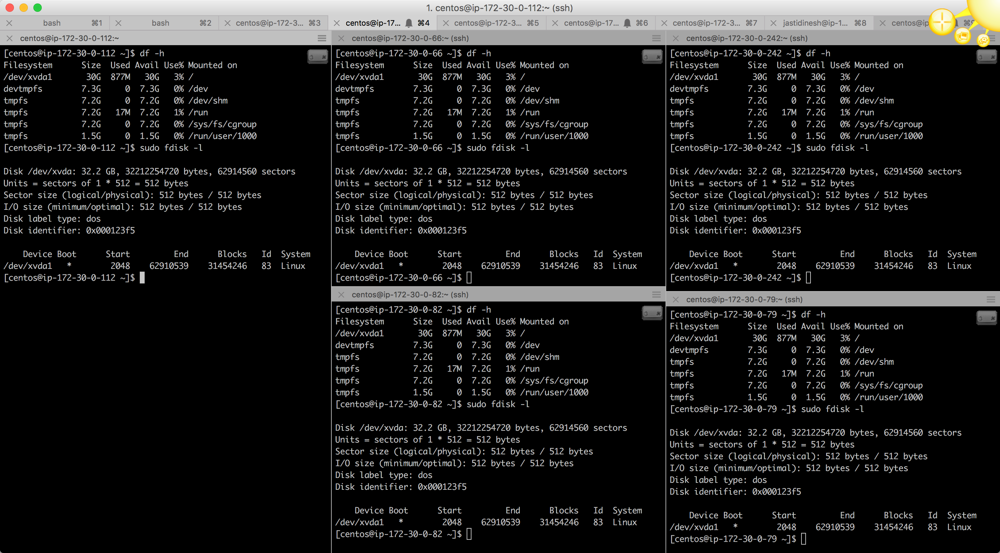
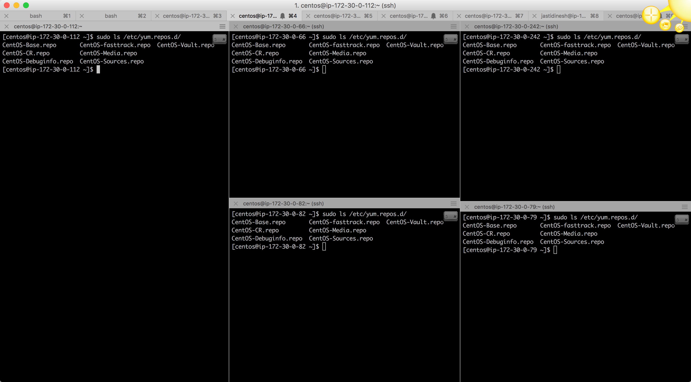
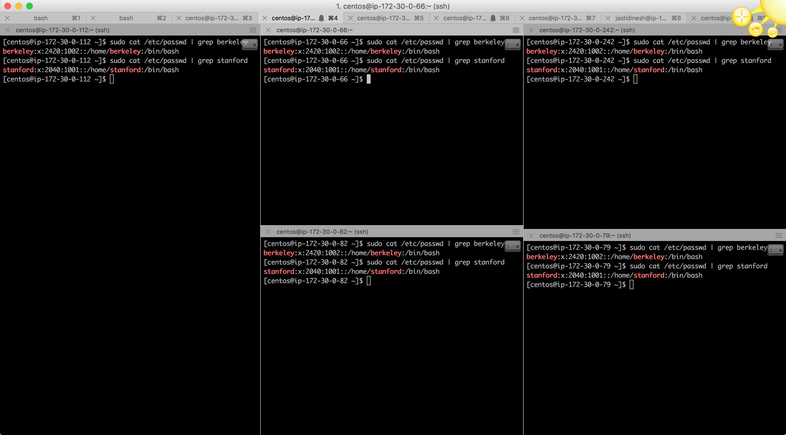
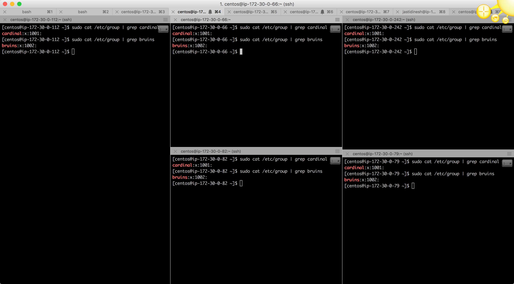

# Initial Setup

#### Cloud Provider 

* AWS 

#### Nodes Used

```commandline
52.90.78.65	ip-172-30-0-112.ec2.internal
54.91.183.187	ip-172-30-0-66.ec2.internal
54.165.227.68	ip-172-30-0-242.ec2.internal
52.90.29.167	ip-172-30-0-82.ec2.internal
54.196.180.181	ip-172-30-0-79.ec2.internal
```
#### OS Version 

* Command : `cat /etc/centos-release`




#### Disk Capacity 

* Attached is the output of the disk details




#### Repo Details 

* Output of `ls /etc/yum.repo.d/`



#### Passwd

* Output of `sudo cat /etc/passwd | grep berkeley` and `sudo cat /etc/passwd | grep stanford`
 


#### Group

* Output of `sudo cat /etc/group | group cardinal` and `sudo cat /etc/group | group bruins`



