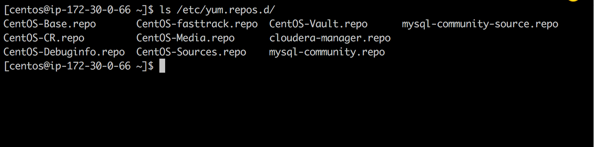
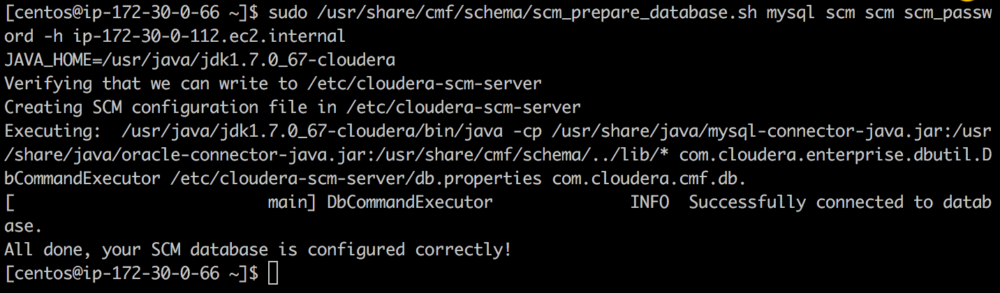

# Cloudera Manager Install


#### Available Repos
 


#### Prepare Database

* Command used `sudo /usr/share/cmf/schema/scm_prepare_database.sh mysql scm scm scm_password -h ip-172-30-0-112.ec2.internal`



#### First Line 

* Command used `sudo head -1 /var/log/cloudera-scm-server/cloudera-scm-server.log`

```commandline
[centos@ip-172-30-0-66 ~]$ sudo head -1 /var/log/cloudera-scm-server/cloudera-scm-server.log
2017-03-24 17:09:12,958 INFO main:com.cloudera.server.cmf.Main: Starting SCM Server. JVM Args: [-Dlog4j.configuration=file:/etc/cloudera-scm-server/log4j.properties, -Dfile.encoding=UTF-8, -Dcmf.root.logger=INFO,LOGFILE, -Dcmf.log.dir=/var/log/cloudera-scm-server, -Dcmf.log.file=cloudera-scm-server.log, -Dcmf.jetty.threshhold=WARN, -Dcmf.schema.dir=/usr/share/cmf/schema, -Djava.awt.headless=true, -Djava.net.preferIPv4Stack=true, -Dpython.home=/usr/share/cmf/python, -XX:+UseConcMarkSweepGC, -XX:+UseParNewGC, -XX:+HeapDumpOnOutOfMemoryError, -Xmx2G, -XX:MaxPermSize=256m, -XX:+HeapDumpOnOutOfMemoryError, -XX:HeapDumpPath=/tmp, -XX:OnOutOfMemoryError=kill -9 %p], Args: [], Version: 5.10.0 (#85 built by jenkins on 20170120-1037 git: aa0b5cd5eceaefe2f971c13ab657020d96bb842a)
```

#### Jetty Server

* Command used `sudo grep 'Started Jetty server' /var/log/cloudera-scm-server/cloudera-scm-server.log`

```commandline
[centos@ip-172-30-0-66 ~]$ sudo grep 'Started Jetty server' /var/log/cloudera-scm-server/cloudera-scm-server.log
2017-03-24 17:10:33,809 INFO WebServerImpl:com.cloudera.server.cmf.WebServerImpl: Started Jetty server.
```

#### DB Properties 

```commandline
# Auto-generated by scm_prepare_database.sh on Fri Mar 24 17:07:02 UTC 2017
#
# For information describing how to configure the Cloudera Manager Server
# to connect to databases, see the "Cloudera Manager Installation Guide."
#
com.cloudera.cmf.db.type=mysql
com.cloudera.cmf.db.host=ip-172-30-0-112.ec2.internal
com.cloudera.cmf.db.name=scm
com.cloudera.cmf.db.user=scm
com.cloudera.cmf.db.setupType=EXTERNAL
com.cloudera.cmf.db.password=scm_password
```