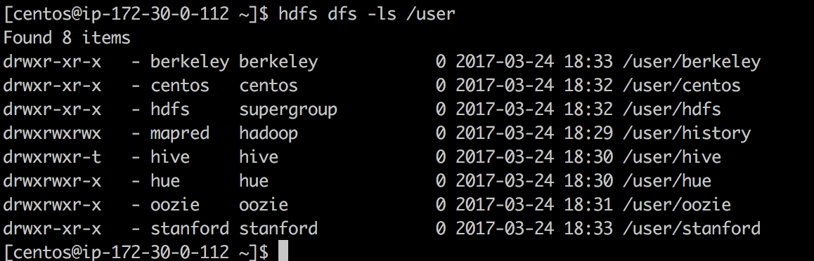

# CDH Installation


#### Users Dir Available 

* Command used `hdfs dfs -ls /user`



#### Hosts In the Cluster 

* Command used `curl -u admin:admin http://ip-172-30-0-66.ec2.internal:7180/api/v14/hosts`

```commandline
[centos@ip-172-30-0-112 ~]$ curl -u admin:admin http://ip-172-30-0-66.ec2.internal:7180/api/v14/hosts
{
  "items" : [ {
    "hostId" : "16c251d3-0e71-46d3-83bf-f9eb1daa403a",
    "ipAddress" : "172.30.0.112",
    "hostname" : "ip-172-30-0-112.ec2.internal",
    "rackId" : "/default",
    "hostUrl" : "http://ip-172-30-0-66.ec2.internal:7180/cmf/hostRedirect/16c251d3-0e71-46d3-83bf-f9eb1daa403a",
    "maintenanceMode" : false,
    "maintenanceOwners" : [ ],
    "commissionState" : "COMMISSIONED",
    "numCores" : 4,
    "numPhysicalCores" : 2,
    "totalPhysMemBytes" : 15332438016
  }, {
    "hostId" : "f236d46c-8982-4c20-9f00-85cdec205367",
    "ipAddress" : "172.30.0.242",
    "hostname" : "ip-172-30-0-242.ec2.internal",
    "rackId" : "/default",
    "hostUrl" : "http://ip-172-30-0-66.ec2.internal:7180/cmf/hostRedirect/f236d46c-8982-4c20-9f00-85cdec205367",
    "maintenanceMode" : false,
    "maintenanceOwners" : [ ],
    "commissionState" : "COMMISSIONED",
    "numCores" : 4,
    "numPhysicalCores" : 2,
    "totalPhysMemBytes" : 15331930112
  }, {
    "hostId" : "6b40be97-3d27-4d06-a4c8-4e5e52365d49",
    "ipAddress" : "172.30.0.66",
    "hostname" : "ip-172-30-0-66.ec2.internal",
    "rackId" : "/default",
    "hostUrl" : "http://ip-172-30-0-66.ec2.internal:7180/cmf/hostRedirect/6b40be97-3d27-4d06-a4c8-4e5e52365d49",
    "maintenanceMode" : false,
    "maintenanceOwners" : [ ],
    "commissionState" : "COMMISSIONED",
    "numCores" : 4,
    "numPhysicalCores" : 2,
    "totalPhysMemBytes" : 15332438016
  }, {
    "hostId" : "6e9fa424-902f-443b-95b7-2a648f074738",
    "ipAddress" : "172.30.0.79",
    "hostname" : "ip-172-30-0-79.ec2.internal",
    "rackId" : "/default",
    "hostUrl" : "http://ip-172-30-0-66.ec2.internal:7180/cmf/hostRedirect/6e9fa424-902f-443b-95b7-2a648f074738",
    "maintenanceMode" : false,
    "maintenanceOwners" : [ ],
    "commissionState" : "COMMISSIONED",
    "numCores" : 4,
    "numPhysicalCores" : 2,
    "totalPhysMemBytes" : 15331930112
  }, {
    "hostId" : "f2240e32-fffa-4e7a-9a54-5ebced7673b1",
    "ipAddress" : "172.30.0.82",
    "hostname" : "ip-172-30-0-82.ec2.internal",
    "rackId" : "/default",
    "hostUrl" : "http://ip-172-30-0-66.ec2.internal:7180/cmf/hostRedirect/f2240e32-fffa-4e7a-9a54-5ebced7673b1",
    "maintenanceMode" : false,
    "maintenanceOwners" : [ ],
    "commissionState" : "COMMISSIONED",
    "numCores" : 4,
    "numPhysicalCores" : 2,
    "totalPhysMemBytes" : 15331930112
  } ]
}[centos@ip-172-30-0-112 ~]$
```
