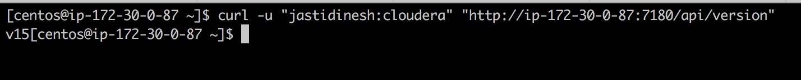
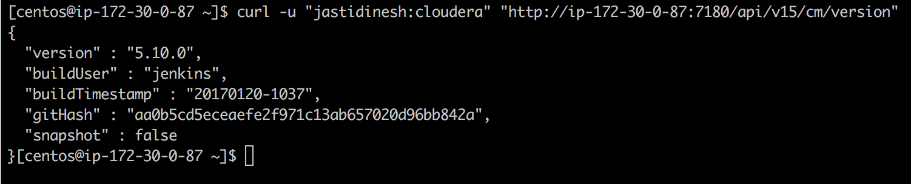
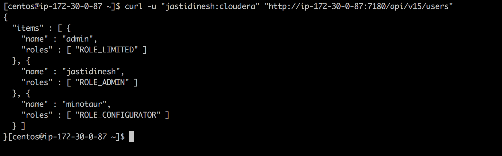
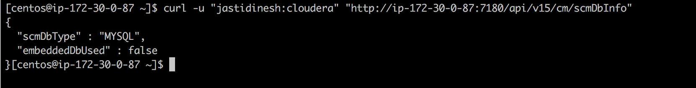

# Upgrade Cloudera Manager

#### Upgrade Steps :
* Stop the `Cloudera Mangement Service` from the CM web UI.
* Stop the cloudera server service on the manager node`sudo service cloudera-scm-server stop`
* Stop the cloudera agent on all the nodes `sudo service cloudera-scm-agent stop`
* Change the repo to point to 5 instead of 5.9.1 in `/etc/yum.repos.d/cloudera-manager.repo`
* Do a yum clean and upgrade :
```commandline
sudo yum clean all
sudo yum upgrade cloudera-manager-daemons cloudera-manager-agent
```
* Upgrade the cloudera server `yum upgrade cloudera-manager-server `
* Start the server again `sudo service cloudera-scm-server start`
* Login into the CM webui and follow through the steps of upgrading the hosts.

#### API Calls :

* Latest Version of API available :



* Get CM Version :



* Get CM Users :



* Get CM Database :



