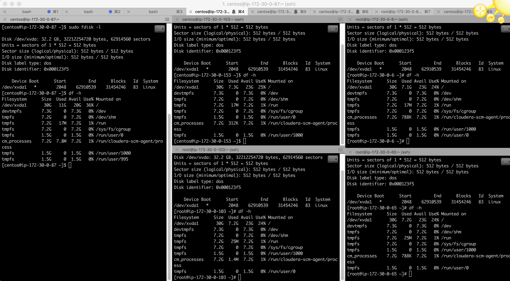
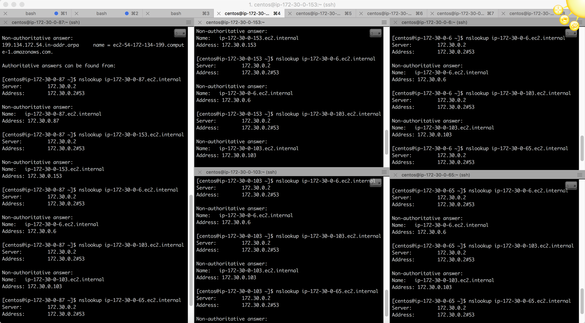
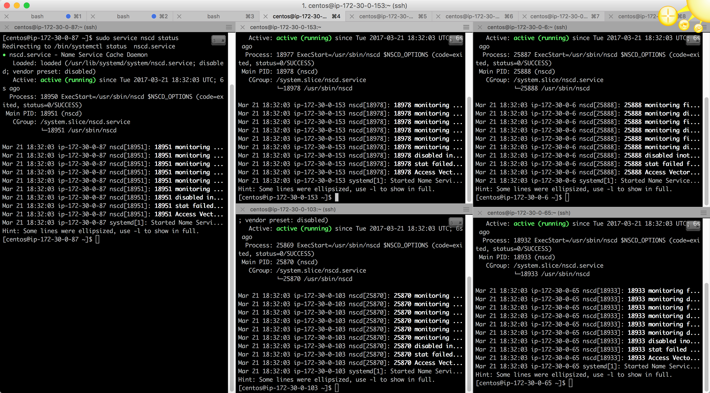
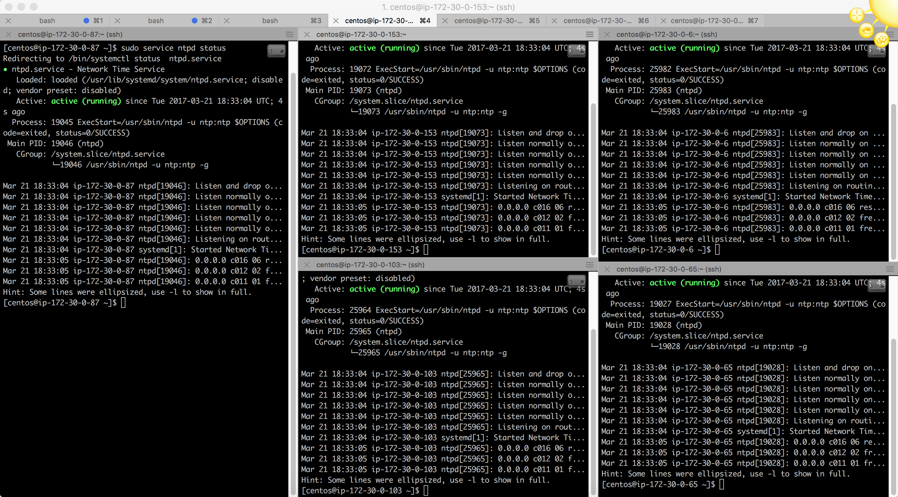

## All the commands used refer to CentOS 7

### Swappiness Values:

How to view the swappiness :

```bash
cat /proc/sys/vm/swappiness
```

Value found in all the nodes : **30**

Changing the values to **1** as it is recommended for machines with more than **8GB** of memory.

How to change swappiness :

To change the swappiness in runtime: `sudo sysctl -w vm.swappiness={value} `

To change it at boot time : edit `/etc/sysctl.conf` and add `vm.swappiness={value}` to the end of it if not already there and edit it if already present.  


### Mount Details.

All the nodes have the 30GB volume mounted at **/dev/xvda**

Command used to check the volume details.

```bash
sudo fdisk -l
```

Output of one of the nodes for that command : 
```commandline
Disk /dev/xvda: 32.2 GB, 32212254720 bytes, 62914560 sectors
Units = sectors of 1 * 512 = 512 bytes
Sector size (logical/physical): 512 bytes / 512 bytes
I/O size (minimum/optimal): 512 bytes / 512 bytes
Disk label type: dos
Disk identifier: 0x000123f5

    Device Boot      Start         End      Blocks   Id  System
/dev/xvda1   *        2048    62910539    31454246   83  Linux
```
 

 
### Transparent Hugepage(THP):

To view the status of the current THP : 
```bash
cat /sys/kernel/mm/transparent_hugepage/enabled
cat /sys/kernel/mm/transparent_hugepage/defrag 
```
To disable THP at boot time : add the following to the bottom of `/etc/rc.d/rc.local`.

```commandline
if test -f /sys/kernel/mm/transparent_hugepage/enabled; then
echo never > /sys/kernel/mm/transparent_hugepage/enabled
fi
if test -f /sys/kernel/mm/transparent_hugepage/defrag; then
echo never > /sys/kernel/mm/transparent_hugepage/defrag
fi
```
Make the rc.local file executable `chmod u+x /etc/rc.d/rc.local`

To disable THP at run time : 
```bash
echo never > /sys/kernel/mm/transparent_hugepage/enabled
echo never > /sys/kernel/mm/transparent_hugepage/defrag
```

### Network Config:

All my nodes have access to the internet and they have a single ethernet connection.

To check network config: `ipconfig`

DNS Lookups : use `nslookup { ip or hostname }`

If you can't find `nslookup` install it using `yum install bind-utils`

All internal and external host mappings :



#### nscd :
nscd is not installed by default in the AMI I chose. So installing it using `sudo yum install nscd`

Service Status : 



#### ntp :
ntp is also not installed by default in the AMI. So installing it using `yum install ntp ntpdate ntp-doc` 

Service Status :




## MySQL Installation :

* Get the repo file from [MySQL Repo](https://dev.mysql.com/downloads/file/?id=465603)
* Install the downloaded repo package : `sudo rpm -Uvh {filename}`
* Edit the `/etc/yum.repos.d/mysql-community.repo` file to disable all the repositories except 5.5.
* Check again if the settings have applied properly : `yum repolist enabled | grep mysql`
* Install mysql server : `yum install mysql`
* Install mysql JDBC connector : `yum install mysql-connector-java`
* Install mysql server on master and replication node : `yum install mysql-community-server`
* Start the service where mysql-server was installed : `service mysqld start`
* Do the initial setup on the master and slave : `mysql_secure_installation`
* Follow the onscreen prompts to complete the root password setup and don't deny the root user remote login and also allow for `Reload Privileages Tables` prompt.
* Add the following lines to the `[mysqld]` snippet inside `/etc/my.cnf` file on your master.
  ```commandline
  log-bin=mysql-bin
  server-id=1
  ```
* Restart the master mysql server : `service mysqld restart`
* Create a slave user in the master mysql instance : `CREATE USER 'repl'@'%' IDENTIFIED BY 'slavepass';`
* Grant permissions for the created used : `GRANT REPLICATION SLAVE ON *.* TO 'repl'@'%'`
* Get the master status : `show master status`
* Add `server-id=2` to `[mysqld]` in slave node.
* Set the master configuration on the slave :
    ```commandline
    CHANGE MASTER TO
    MASTER_HOST='ip-172-30-0-87.ec2.internal',
    MASTER_USER='repl',
    MASTER_PASSWORD='slavepass',
    MASTER_LOG_FILE='mysql-bin.000001',
    MASTER_LOG_POS=333;
    ```
* Start the slave : `START SLAVE` on the slave machine.
* Check the status : `SHOW SLAVE STATUS \G` 
* If the `Slave_IO_State` says that it is waiting to connecting to the master, then try to connect to the master from the slave node.
  ```commandline
    mysql -u repl -h ip-172-30-0-10.ec2.internal -p 
    ```
* In the above step you are able to connect then something must be wrong with the way the master configurations are set on the salve.
* If you are not able to connect in the above step then try doing a telnet just to verify that you are able to access the master and the port `telnet ip-172-30-0-87.ec2.internal 3306` 
* If telnet was successful then something might be wrong with the user permission which you are trying to login as.
* If telnet has failed then open up the port in the master machine using `firewalld`.
  ```commandline
    sudo firewall-cmd --zone=public --add-port=3306/tcp --permanent
    sudo firewall-cmd --reload
    ```
* If firewall-cmd is not found, install it using `yum install firewalld`   
* After changing the `firewalld` you should be able to see the state change. 
* If still not able to get any data then proceed according to the error msg you are getting.
* Making MySQL start on system boot :
```commandline
etc/systemd/system/multi-user.target.wants/mysqld.service
sudo systemctl enable mysqld.service
sudo systemctl daemon-reload
sudo systemctl restart mysqld.service
```

