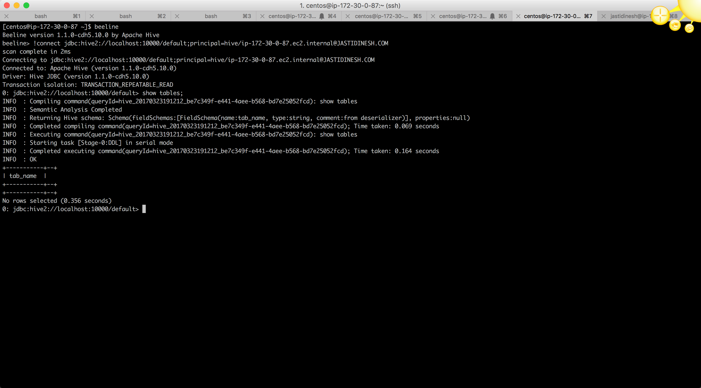
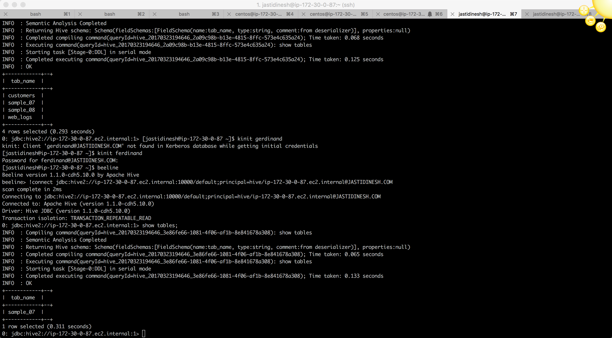

# Sentry 

#### Beeline Auth :

* Start your `beeline` shell and use `!connect` to establish a connection to your hive server.
* Command used to connect :
* `!connect jdbc:hive2://localhost:10000/default;principal=hive/ip-172-30-0-87.ec2.internal@JASTIDINESH.COM`

#### Sentry Roles Test :

