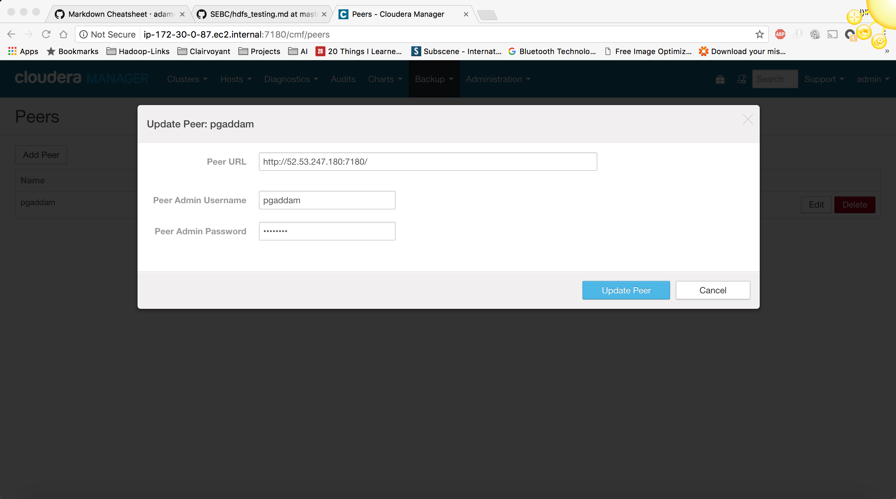
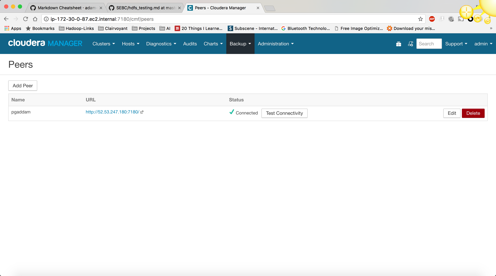
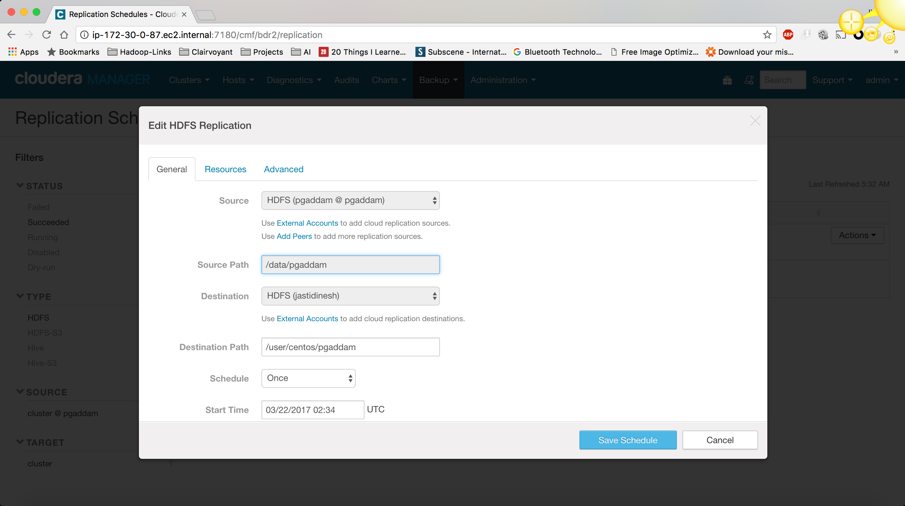
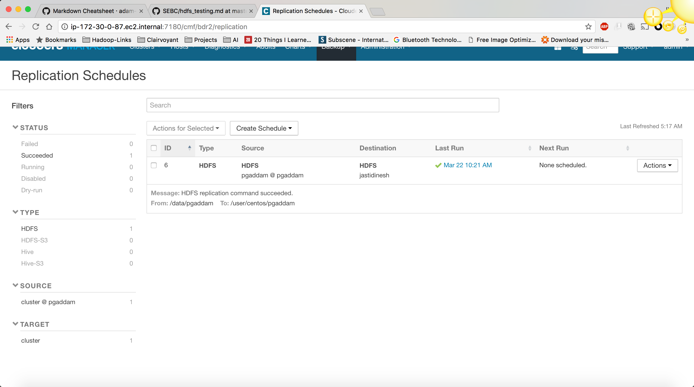
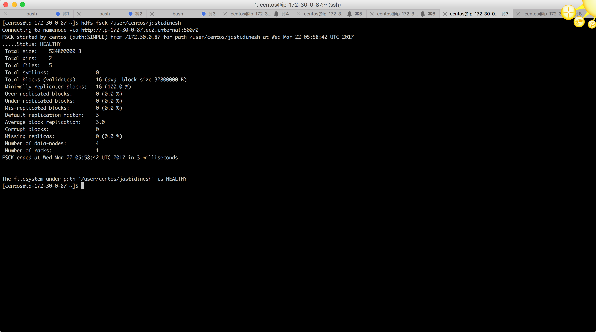
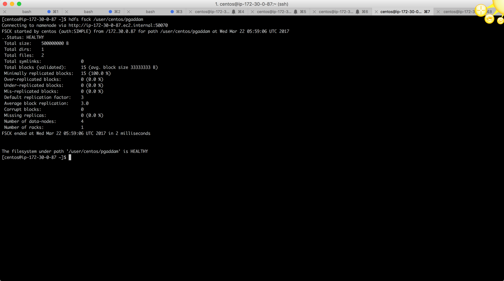

# Replication 

I did the replication using Cloudera BDR. Even though one uses BDR in the background it kicks off a Distcp Job.

#### BDR:

* Goto CM web UI click on `Backups` and select `Peers`.
* Click on Add Peer and fill in the details of your partners cluster there.
* The `Peer URL` is the url of the CM of your partners CM web page `http://52.53.247.180:7180/`
* The `Peer Admin Username` and the `Peer Admin Password` are the login credentials for the CM web page.





* After adding the peer click on backup and goto `Replication Schedules`
* Click on `Create Schedule` and select `HDFS Replication`
* Give the `Source` as the Peer which you have just added.
* And the `Source Path` as the path from where you want to get data.
* `Destination` would be the Cluster where you want to get the data into, in this case our own cluster. So, select that from the dropdown.
* `Destination Path` is the path where you want the data from the `Source Path` to be copied into.
* Select the `Schedule` as `Immediate` as we are just going to be doing this only once.
* You can check the properties in `Resources` and `Advanced` tab but you can leave them as is for now.
* Click on `Save` that will create a `Schedule` in the `Replication Schedules` page.





* After this step you can select the schedule and do a `Dry Run` of the schedule from the `Actions`
* If the `Dry Run` is successful you can select the `Run Now` action and that will start the copy of the data immediately.
 
* This the actual `distcp` that is executed in the background.
```commandline
dr/distcp.sh ["-i","-prbugp","-update","-log","/user/hdfs/.cm/distcp/2017-03-22_399","-sourceconf","source-client-conf","-useSnapshots","-ignoreSnapshotFailures","-diff","distcp-6-1136408007","-strategy","dynamic","-filters","exclusion-filter.list","-scheduleId","6","/data/pgaddam","/user/centos/pgaddam"]
```

#### FSCK Outputs :

Source Directories


Target Directories

 
# Issues :

These are more like pre-config steps that have to be done for the transfer to be complete. 
 
* We need to check if we are able to access the partners internal ip's from our machines or not.
* Do a `telnet` to see if you are able to reach the `50010` for datanode and `50070` namenode
* Sometimes you may not reach the actual IP but still see if you can reach the ports.
* We are trying to check if we can connect to the actual ip address not **hostname**
* If we are not able to access the internal ip address then we can redirect the internal ip requests to the external ips using `iptables`
* The reason why we have to do this is because the partners `namenode` will send us the internal ips of the cluster to connect to and get the data
* Iptables command to route the requests from internal ip to external ips :
`sudo iptables -t nat -A OUTPUT -d {internal ip} -j DNAT --to-destination {external ip}` without the `{`
* After running this command for all the data nodes on all the data nodes of your cluster run the job again and it should be successful.
* If the above changes are not mode you won't see any errors but the jobs will be running for a long with an timed out exception in the logs which will be running forever and you would not even know that something is wrong.
 
 
