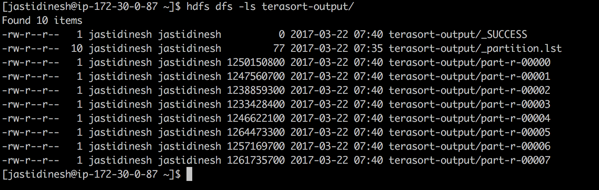

# Terasort Tests

#### Create a user with your git handle :
```commandline
sudo adduser username
sudo passwd username
sudo usermod -aG wheel username
```

The last step will add the provided username to the `wheel` group which have `sudo` privileges
Create this user on all the nodes of your cluster.

Create the same user in `hue` as well and do remember to enable `Create home directory`


#### Generate data using Teragen:

Command used generate 10GB of data with teragen with 4 mappers and 32MB of HDFS block size :
 `hadoop jar /opt/cloudera/parcels/CDH/jars/hadoop-examples.jar teragen -Dmapred.map.tasks=4 -Ddfs.block.size=33554432 100000000 /user/jastidinesh/teragen-data/`


The time it took to generate the data `3min`


Generated data files :


#### Sort the generated data using Terasort :

Command used to sort the data produced in the previous step and save the output :
`time hadoop jar /opt/cloudera/parcels/CDH/jars/hadoop-examples.jar terasort ./teragen-data ./terasort-output`


The time it took to sort the data was `5min and 25 seconds`


Generated output files :



